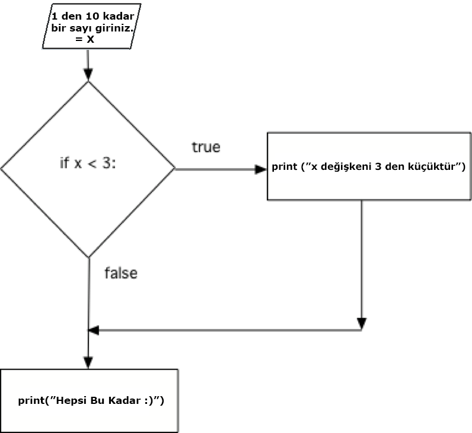

..  Copyright (C)  Mark Guzdial, Barbara Ericson, Briana Morrison
    Permission is granted to copy, distribute and/or modify this document
    under the terms of the GNU Free Documentation License, Version 1.3 or
    any later version published by the Free Software Foundation; with
    Invariant Sections being Forward, Prefaces, and Contributor List,
    no Front-Cover Texts, and no Back-Cover Texts.  A copy of the license
    is included in the section entitled "GNU Free Documentation License".

.. 	qnum::
	:start: 1
	:prefix: csp-12-2-
	
.. highlight:: python
   :linenothreshold: 3

if Deyimi ~ The if Statement
=====================
..	index::
	pair: if; statements
	single: logical expression
	single: Boolean expression
	single: Conditional expression
	
Python dilinde, veriyi test eder ve ``if`` deyimini kullanılarak veri doğru ise talimatları uygularız. Bu if deyimi 'test' adında bir **mantıksal ifade (logical expression) ** içermektedir. Bu mantıksal ifadenin değeri doğru veya yanlıştır.buna **Boolean ifade (Boolean expression)** denmektedir. Örnek olarak mantıksal ifademiz ``x < 3`` . ``if`` deyimi mantıksal ifademizin hemen öncesinde yazılmaktadır ``if x < 3:`` ve **kod bloğu (block of code)**. ``if`` deyiminin sonunda bulunan Kolon (colon) (``:``) ayracı zorunludur. Ayracın sonrasındaki kod bloğumuzda ise ``if`` deyimimiz yani x<3 işlemi doğru ise yapılmasını istediğimiz işlemlerin sıralı listesi bulunamaktadır. ``if`` deyimi sonrası yazdığımız kod bloğumuz if deyimimizden *girintili yazılmış (indented)* olarak yazılmalıdır. Eğer ``if`` deyimimizin sonucu doğru ise if deyiminin gövdesindeki kod bloğu çalıştırılıp bilgisayar tarafından yapmasını istediğimiz işlemler yerine getirilecek, ``if`` deyimimiz doğru değil ise kod bloğumuzda bulunan kodlarımız bilgisayar tarafından yorumlanmadan ``if`` deyimimizden sonraki işlemlere atlayacaktır. 

.. In Python, we test data and execute instructions if the test is true using an ``if`` statement.  An ``if`` statement includes a **logical expression** which is the 'test.'   A **logical expression** is one that is either true or false.  This is also called a **Boolean expression**.  An example of a **logical expression** is ``x < 3``. The ``if`` statement is followed by a colon ``if x < 3:`` and a **block of code**.  The colon (``:``) at the end of the ``if`` statement is required.  The **block of code**  includes the instructions to execute if the test is true.  The **block of code** includes all the statements that are indented following the ``if`` statement.  If the test is true, execute the statement or statements in the block following the ``if`` will be executed.  If the test isn't true (is false) then execution will skip the block following the if and continue with the next statement following the block after the ``if`` statement.  
    
.. Run the code below with x set to 0 and then change x to 4 and see how the output differs depending on the value of x.
Aşağıdaki kod bloğunu çalıştırarak 1’den 10’a kadar bir sayı girin ve girmiş olduğunuz sayının 3 den büyük olup olmadığını ``if`` deyimi ile kontrol edin.   
    
.. activecode:: If_Yapisi
    :tour_1: "Yapisal Tur"; 1: c0-line1; 2-3: c0-line2-3; 4: c0-line4;

    x = int(input("1'den 10'a kadar bir sayi giriniz"))
    if x < 3:
    	print ("x 3'ten kucuktur")
    print ("İşlem tamamlandı")
    
..	index::
	single: flowchart
	single: condition
    

Aşağıda resimde bulunan işlemler listesi **akış diagramı (flowchart)** olarak adlandırılır.  Elmasa benzer olan şekil **mantıksal ifade (logical expression)** (aynı zamanda koşul olarak da adlandırılır)dir ve ifade sonucuna göre yapılacak işlemlerin şematiğini göstermektedir.Eğer if deyimimiz yanlış ise if deyiminin altında girintili olarak yazdığımız kod bloğumuz bilgisayar tarafından yorumlanmayacak ve bilgisayar yorumlamak üzere sonraki ifadelere geçecektir.

.. The figure below is called a **flowchart**.  It shows the execution paths for a program.  The diamond shape contains the **logical expression** and shows the path that the execution takes if the logical expression (also called the **condition**) is true as well as the path if the logical expression is false.  Notice that it will only execute the statements in the indented block if the logical expression was true.  If the logical expression was false, execution will skip the code in the indented block and resume with the next statement.

    Figure 3: Flow of execution for an if statement
    
.. mchoice:: 12_2_1_If_Yapisi
  :answer_a: 3. satır
  :answer_b: 4. satır
  :correct: b
  :feedback_a: Yanlış. 3. Satır sadece x değişkeninin değeri 3 den küçük olduğunda çalışacaktır.
  :feedback_b: Doğru. Bilgisayar if deyiminin koşul ifadesi yanlış (false) olduğundan koşulun doğru olması durumunda çalıştırılacak olan girintili (indented) kod bloğunu atlayarak 4. Satırı çalıştıracaktır.

   Aşağıdaki kod bloğu çalıştırıldığında 2. Satırdan sonra hangi satır çalışır? 
   
   :: 
   
     x = 4
     if x < 3:
         print ("x degişkeninin degeri 3'ten kucuk")
     print ("İşlem tamamlandı")

