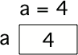

..  Copyright (C)  Mark Guzdial, Barbara Ericson, Briana Morrison
    Permission is granted to copy, distribute and/or modify this document
    under the terms of the GNU Free Documentation License, Version 1.3 or
    any later version published by the Free Software Foundation; with
    Invariant Sections being Forward, Prefaces, and Contributor List,
    no Front-Cover Texts, and no Back-Cover Texts.  A copy of the license
    is included in the section entitled "GNU Free Documentation License".

.. |audiobutton| image:: Figures/start-audio-tour.png
    :height: 20px
    :align: top
    :alt: audio tour button

.. |codelensfirst| image:: Figures/codelens-first.png
    :height: 20px
    :align: top
    :alt: move to first button

.. |codelensback| image:: Figures/codelens-back.png
    :height: 20px
    :align: top
    :alt: back button

.. |codelensfwd| image:: Figures/codelens-forward.png
    :height: 20px
    :align: top
    :alt: forward (next) button

.. |codelenslast| image:: Figures/codelens-last.png
    :height: 20px
    :align: top
    :alt: move to last button
    
.. 	qnum::
	:start: 1
	:prefix: csp-3-1-

.. highlight:: java
   :linenothreshold: 4

İsim Atama ~ (Assigning a Name)
==================
*Öğrenme Hedefleri:*

- Değişken (variable) konseptini anlamak.
- Değişkene bir değer atamak.
- Atama işlemini hesaplamalarda kullanmak.
- Öğrencilerin atama işlemlerinde yaptıkları yanlışları anlamak.
- Bir değişkeni birden fazla atama işleminde kullanmak.

.. *Learning Objectives:*

.. - Understand the concept of a variable.
.. - Assign a value to a variable.
.. - Use assignment in calculations.
.. - Understand the ways that students get assignments wrong.
.. - Reuse variables across different assignment statements.
	
..	index::
	single: variable
	pair: programming; variable

Bilgisayarlar bir ismi bir değerle ilişkilendirir. Bunu yapabilmek için bilgisayarın hafızasında yer tutan ve bir değeri temsil eden **değişken (variable)** yaratır. Değişkene örnek olarak bir bilgisayar oyunundaki skor verilebilir. Skor genellikle 0 olarak başlar ve oyunu oynadıkça artar. Skor oyun boyunca değişkenlik gösterebileceği için, skoru tutan şeye **değişken** ismi veriliyor. Siz de telefonunuza yeni bir numara kaydedeceğiniz zaman girilecek numarayı bir isimle ilişkilendiriyorsunuz. Dolayısıyla telefonunuza “Selin” ‘i aramak istediğinizi söylediğinizde, telefonunuz Selin ile ilişkilendirilmiş telefon numarasını bulup arıyor. 

	
.. A computer can associate a name with a value.  It does this by creating a **variable**, which is space in computer memory that can represent a value. An example of a **variable** is a score in a computer game.  The score usually starts at 0 and increases as you play the game.  The score can change or *vary* during the game, which is why we call it a **variable**. You also associate a name with a value when you enter a new contact name and phone number in your cell phone. When you tell your phone to call "Alexa" it will look up the phone number associated with that name and call it.  

.. figure:: Figures/pongScore.png
    :width: 400px
    :align: center
    :figclass: align-center
    
    Figure 1: A pong game in `Scratch <http://scratch.mit.edu>`_ with a score shown in the upper left.
  
Bir değişkeni, üzerinde etiketi olan ve içinde bir değer saklayabileceğiniz bir kutu olarak düşünebilirsiniz. Değer dediğimiz şey bilgisayarın hafızasında temsil edilip depolanabilen her hangi bir şey olabilir. Bir bilgisayarın hafızası sadece sayılardan oluşur (aslında voltaj’ın düzenlemesine göredir ancak biz onları sayılar olarak düşünebiliriz). Bir bilgisayarın hafızasında hatırlayabildiği her şey bu sayılara dönüştürülür. Ancak bunun nasıl olduğuyla ilgili şimdilik endişelenmenize gerek yok.
  
.. Think of a variable as a box that has a label on it and you can store a value in the box.  The value can be anything that can be represented on a computer and stored in a computer's memory.  A computer's memory is only made up of numbers (really, just patterns of voltages, but we can think about them as numbers).  Everything that a computer can remember in its memory is translated into these numbers -- but don't worry about how this works right now.

    
    Figure 2: Creating a variable and setting its value in memory.

..	index::
	single: assignment
	pair: programming; assignment

Programlama dillerinde, bir değişkene bir değer koyma işlemine **atama (assignment)** denir. ``a = 4`` gibi bir deyim (statement) aslında  ``a`` sembolünün bilgisayarın hafızasında bir yere denk geldiğini ve bu yere değer olarak ``4`` atandığı anlamına gelir. Biz ``a`` sembolünü bir programda kullandığımızda, bilgisayar o sembolün yerine ``4`` değerini koyacaktır. Eğer daha sonra ``a`` değişkenindeki değeri değiştirmek istiyorsak, bunu ``a = 7.2`` diyerek rahatlıkla yapabiliriz. Böylece a değişkeni artık ``7.2`` değerine sahip olacak ve ``a`` etiketine sahip kutudaki (hafıza) değer ``7.2`` olarak güncellenecektir.

	
.. In programming languages, setting a variable's value is also called **assignment**.  A statement like ``a = 4`` means that the symbol ``a`` refers to space (in the computer's memory) that is assigned the value ``4``.  When we use the symbol ``a`` in a program the computer will substitute the value ``4``.  If we later change the value stored at ``a``, say by doing ``a = 7.2`` then we say that the variable ``a`` now has the value ``7.2`` meaning that the value in the box (memory) associated with the name ``a`` is changed to ``7.2``.

    
    Figure 3: Changing the value of a variable in memory

**Sıradaki videoyu oynatmak için lütfen sağdaki oka tıklayınız.**

.. video:: intro_assignment
   :controls:
   :thumb: ../_static/video-think-about-assignment.png

   http://ice-web.cc.gatech.edu/ce21/1/static/video/assignment-v2-small.mov
   http://ice-web.cc.gatech.edu/ce21/1/static/video/assignment-v2-small.webm
   
Geçerli (Legal) Değişken İsimleri ~ Legal Variable Names
----------------------

..	index::
	single: variable names

Değişken isimleri için bazı kısıtlamalar vardır: 

.. There are restrictions on what you can use as a variable name. 
* Değişken isimleri bir harf ile (``A`` gibi bir büyük harf ya da ``a`` gibi bir küçük harf) ya da alt tire ``_`` ile başlamalıdır.
* değişken isimleri rakam içerebilir ama rakamlar ilk karakter olamaz.
* Python diline ait anahtar sözcükler (keyword) deişken ismi olamaz (``and``, ``def``, ``elif``, ``else``, ``for``, ``if``, ``import``, ``in``, ``not``, ``or``, ``return``, or ``while``). Çünkü bu sözcüklerin Python dilinde dile özgü özel anlamları vardır. 
* Değişken isimlendirmesinde büyük harf küçük harf önemlidir. Mesela ``result`` ve ``Result`` isimli iki değişken birbirinden tamamiyle bağımsızdır.Python **büyük-küçük harf duyarlı (case sensitive)** bir dildir. 

.. * It must start with a letter (uppercase like ``A`` or lowercase like ``a``) or an underscore ``_``
.. * It can also contain digits, like ``1`` or ``9``, just not as the first character
.. * It can't be a Python keyword such as ``and``, ``def``, ``elif``, ``else``, ``for``, ``if``, ``import``, ``in``, ``not``, ``or``, ``return``, or ``while``.  These have special meaning in Python and are part of the language.
.. * Case does matter.  A variable named ``result`` is not the same as one named ``Result``.

Bir değişken isminde boşluk kullanamayacağınız için, isterseniz ilk kelimeden sonraki her kelimenin ilk karakterini büyük harf yaparak birleştirebilir (``uzunlukMetreCinsinden``) ya da kelimeler arasında alt çizgi koyabilirsiniz (``uzunluk_metre_cinsinden``). Her kelimenin ilk harflerini büyük yapma olayı **camel-case** ya da **mixed-case** olarak adlandırılır.

.. Since you can't have spaces in a variable name you can either join words together by uppercasing the first letter of each new word like ``heightInInches`` or use underscores between words ``height_in_inches``.  Uppercasing the first letter of each new word is called **camel-case** or **mixed-case**.  

.. mchoice:: 3_1_1_varNames_Q1
   :answer_a: _a1
   :answer_b: my_name
   :answer_c: amountOfStuff
   :answer_d: BMP
   :answer_e: 1A
   :correct: e
   :feedback_a: Alt tire karakterini bir değişkenin ilk karakteri olarak kullanabilirsin.
   :feedback_b: Alt tire karakterini bir değişkende kelimeleri ayırmak için kullanabilirsin.
   :feedback_c: Büyük ya da küçük harfi bir değişken isminde karışık olarak kullanabilirsin.
   :feedback_d: Bir değişken sadece büyük harflerden de oluşabilir.
   :feedback_e: Bir rakamı bir değişkenin ilk harfi olarak kullanamazsın)

   Aşağıdakilerden hangisi geçerli bir değişken ismi değildir?

..   :answer_a: _a1
..   :answer_b: my_name
..   :answer_c: amountOfStuff
..   :answer_d: BMP
..   :answer_e: 1A
..   :correct: e
..   :feedback_a: You can use an underscore as the first character in a variable name
..   :feedback_b: You can use an underscore between words in a variable name.
..   :feedback_c: You can use both uppercase and lowercase letters in a variable name.
..   :feedback_d: You can use only uppercase letters in a variable name.
..   :feedback_e: You can't use a digit as the first letter in a variable name.

..   Which of the following is *not* a legal variable name?
 

..   :answer_a: _my_name
..   :answer_b: my name
..   :answer_c: myname
..   :answer_d: myName
..   :answer_e: my_name
..   :correct: b
..   :feedback_a: This is legal, but you don't usually start a variable name with an underscore.
..   :feedback_b: You can't have a space in a variable name.  
..   :feedback_c: This may be hard to read, but it is legal.  
..   :feedback_d: Since you can't have spaces in names, one way to make variable names easier to read is to use camel case (uppercase the first letter of each new word).  
..   :feedback_e: Since you can't have spaces in names, one way to make variable names easier to read is to use an underscore between two words.  

..   Aşağıdakilerden hangisi legal değişken ismi *değildir*?

  
.. mchoice:: 3_1_2_varNames_Q2
   :answer_a: _my_name
   :answer_b: my name
   :answer_c: myname
   :answer_d: myName
   :answer_e: my_name
   :correct: b
   :feedback_a: Geçerli bir kullanım ancak genel olarak alt tireyi ilk karakter olarak kullanmıyoruz.
   :feedback_b: Değişken isimlerinde boşluk karakteri kullanamazsın. 
   :feedback_c: okumak belki zor olabilir ama geçerli bir kullanım 
   :feedback_d: Değişkenlerde boşluk kullanılmadığı için bir değişken ismini daha okunur yapmanın bir yolu ilkinden sonraki bütün kelimelerin ilk harflerini büyük yapmaktır.(Camel case)  
   :feedback_e: Değişkenlerde boşluk kullanılmadığı için bir değişken ismini daha okunur yapmanın bir yolu kelimeleri alt tire ile birleştirmektir 

   Aşağıdakilerden hangisi legal değişken ismi *değildir*?

