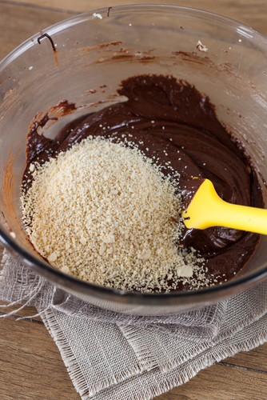

..  Copyright (C)  Mark Guzdial, Barbara Ericson, Briana Morrison
    Permission is granted to copy, distribute and/or modify this document
    under the terms of the GNU Free Documentation License, Version 1.3 or
    any later version published by the Free Software Foundation; with
    Invariant Sections being Forward, Prefaces, and Contributor List,
    no Front-Cover Texts, and no Back-Cover Texts.  A copy of the license
    is included in the section entitled "GNU Free Documentation License".

.. 	qnum::
	:start: 1
	:prefix: csp-7-1-
	
.. highlight:: java
   :linenothreshold: 4

	
Adımları Tekrar Etme
=====================================

..	index:
	single: variable
	single: index variable
	single: definite loop
	pair: statements; for

*Öğrenme Hedefleri:*

- Kodların tekrarlanması için ``for`` loop kullanmak,
- Sayı listesi oluşturmak için ``range`` kullanmak.

Genelde yaptığımız işlemlerdeki kod adımlarını tekrar etmemiz gerekebilir. Örnek olarak kek yapıyorsak, kek tarifinde malzeme eklendikten sonra 50 kere karıştırmamız veya tereyağı yumuşayana veya eriyene kadar karıştırmamız yazılıdır.  Hamuru 50 kere karıştırmak sizin için zor olmayabilir, peki 1000 kere karıştırmak? Bunun için bir makine kullanmak isteyebilirsiniz.

.. *Learning Objectives:*

.. - Use a ``for`` loop to repeat code.
.. - Use ``range`` to create a list of numbers

.. We often have to repeat steps in a process.  If you are making a cake the recipe might say add an ingredient and then stir it 50 times or until the batter is smooth.  You can probably handle stirring the batter 50 times, but what if you had to stir it 1,000 times?  You might want a machine to do that.

    Figure 1: A cake mix that must be stirred
    
..	index::
	single: loop
	single: iteration

Bilgisayarlar hiçbir zaman yorulmaz. Aynı işlemi kaydırma veya hata yapmadan bilgisayarlar ile birçok kere yapabiliriz. Bilgisayar, bir programı elektrik olduğu sürece sürekli çalıştırabilir. Ama bunun için bilgisayara istediğimiz işlemi tekrar tekrar yapmasını bir şekilde söylememiz gerekir. Bilgisayarlar bir programdaki adımları nasıl tekrarlayacaklarını bilirler, bilgisayarların bu adımları tekrarlama işlemine **döngü (loop)** veya **tekrarlama (iteration)** denir. Örnek olarak diline dolanmayı verebiliriz. Aklınıza gelen veya duyduğunuz bir şarkının gün içerisinde devamlı aklınıza gelmesini düşünebilirsiniz.

.. A computer never gets tired.  It can do the same thing over-and-over without slipping up.  It can execute a program for as long as it has electricity.  So, there must be a way to tell a computer to do things over-and-over.  Computers know how to repeat steps in a program and the way they do this is often called a **loop** or **iteration**.  Have you ever had an **earworm**?  This is when a song gets stuck in your head and keeps repeating as if the song was set to **loop** (repeat after playing).

