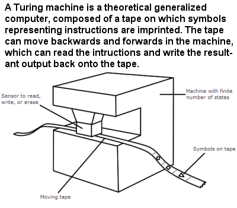

 .. Copyright (C)  Mark Guzdial, Barbara Ericson, Briana Morrison
    Permission is granted to copy, distribute and/or modify this document
    under the terms of the GNU Free Documentation License, Version 1.3 or
    any later version published by the Free Software Foundation; with
    Invariant Sections being Forward, Prefaces, and Contributor List,
    no Front-Cover Texts, and no Back-Cover Texts.  A copy of the license
    is included in the section entitled "GNU Free Documentation License".

..  shortname:: Chapter2: What can Computers Do?
..  description:: Describes what a computer can do.

.. setup for automatic question numbering.

.. 	qnum::
	:start: 1
	:prefix: csp-2-2-

Turing Makineleri ~ Turing Machines
==================================

..	index::
	single: Turing, Alan
	single: Turing Machine

Bilgisayar kavramı fikir olarak, ilk elektronik bilgisayarın icadından birkaç yıl önce 1936'da ortaya atıldı. Parlak bir matematikçi olan 	`Alan Turing <http://en.wikipedia.org/wiki/Alan_Turing>`_, matematikçilerin 20. yüzyıl başlarında mücadele ettiği bir soruyu yanıtlamaya çalışıyordu, "Matematiğin sınırları nedir? Matematiği kullanarak ne hesaplanabilir ve hangi gerçekler matematikle hesaplanamaz? Alan Turing, bu soruya cevap veren bir cihazı yani Turing Makinesi'ni (`Turing Makinesi <https://tr.wikipedia.org/wiki/Alan_Turing>`_ ~ `Turing Machine <http://en.wikipedia.org/wiki/Turing_machine>`_) şu şekilde tanımladı :  "Matematiksel olarak hesaplanması mümkün olan her şey Turing Makinesi üzerinde programlanabilir."

.. The idea for a computer was first described in 1936, over a dozen years before the first electronic computer was ever built.  `Alan Turing <http://en.wikipedia.org/wiki/Alan_Turing>`_, a brilliant mathematician, was trying to answer a question that mathematicians were struggling with at the beginning of the 20th century, "What are the limits of mathematics?  What can be computed using mathematics, and what truths can't be computed?"  Turing defined a device (a `Turing Machine <http://en.wikipedia.org/wiki/Turing_machine>`_) that answered that question: *Anything that is possible to mathematically compute could be programmed on a Turing Machine.* 

.. figure:: Figures/Alan_Turing_photo.jpg
    :width: 200px
    :align: center
    :alt: A Photo of Alan Turing 
    :figclass: align-center
        
    Figure 2: Photo of Alan Turing
  
.. mchoice:: 2_2_1_Turing_Q1
		   :answer_a: Bazen Londra'daki toplantılara 40 mil boyunca koşarak gitti. 
		   :answer_b: Bir bilgisayarın akıllı olup olmadığına karar vermek için Turing Testi'ni kullanmayı önerdi.   
		   :answer_c: İkinci Dünya Savaşı'nda Enigma şifrelerini kırmaya yönelik çalışmalar yaptı. 
		   :answer_d: Eğitimini Oxford, İngiltere'de tamamladı.
		   :correct: d
		   :feedback_a: Doğru.  Yetenekli bir koşucuydu, olimpiyatlara katılmayı bile denedi. 
		   :feedback_b: Doğru.  "Eğer bir bilgisayar, bir insana kendisinin (bilgisayarın) insan olduğunu düşündürebilirse o bilgisayar zekidir" demiştir
		   :feedback_c: Doğru.  Winston Churchill, Alan Turing'in İkinci Dünya Savaşı'nın kazanılmasında tek başına en büyük katkıyı yapan kişi olduğunu, söylemiştir  
		   :feedback_d: Yanlış. Cambridge ve Princeton üniversitelerinde King's College'e gitmiştir. 

		    Alan Turing ile ilgili aşağıdakilerden hangisi **yanlıştır** ? Eğer fikrin yoksa linki ziyaret etmek isteyebilirsin `Alan Turing <http://en.wikipedia.org/wiki/Alan_Turing>`_.

..		   :answer_a: He occasionally ran 40 miles to London for meetings.
..		   :answer_b: He proposed the Turing Test to decide if a computer was intelligent.   
..		   :answer_c: He worked on breaking Enigma ciphers in World War II.   
..		   :answer_d: He went to school in Oxford, England. 
..		   :correct: d
..		   :feedback_a: This is true.  He was a talented runner and even tried out for the olympics.
..		   :feedback_b: This is true.  He said that if a computer could fool a person into thinking it was a person, that that computer was intelligent.  
..		   :feedback_c: This is true.  Winston Churchill said that Alan Turing made the single biggest contribution to winning World War II.   
..		   :feedback_d: This is false.  He attended King's College at Cambridge and Princeton University.

..		   Use the following link to learn more about `Alan Turing <http://en.wikipedia.org/wiki/Alan_Turing>`_.  Which of the following is **false** about him?

Günümüz bilgisayarları, çalışma prensibi olarak Turing Makinesi'nden farklı olsa da matematiksel olarak aynı mantıktadırlar. *Matematiksel olarak hesaplanabilecek her şey, modern bilgisayarlarda programlanabilir.* **Tüm bilgisayarlar**, evinizdeki mikrodalga fırınlardan hava durumu tahmini yapan süper bilgisayarlara kadar hepsi aynı temel yeteneklere sahiptir. Turing Makineleri'nin nasıl çalıştığını merak ettiysen ve Turing Makineleri hakkında daha çok öğrenmek istersen `tıklayabilirsin. <http://www.storyofmathematics.com/20th_turing.html>`_

.. Today's computers work differently than Turing's machine, but are mathematically equivalent.  *Anything that is possible to compute can be programmed on any modern electronic computer.*  **ALL** computers, from the ones in your microwave to the super-duper computers that predict the weather all have the same basic abilities.  Click on the following link to learn more about `how Turing Machines work. <http://www.storyofmathematics.com/20th_turing.html>`_

        
    Figure 3: Figure of a Turing Machine

Yukardaki ifadelerin anlamsal derinliğine dikkat edelim. Çünkü bu, herhangi bir bilgisayarda herhangi bir program çalıştırmanın mümkün olduğu anlamına gelir, ancak çalışmasını sağlamak için çok fazla programlama yapmanız gerektiği anlamına da gelir. Fakat herhangi bir bilgisayardaki **tüm** sorunları çözebileceğimiz anlamına gelmez. Turing'in kanıtladığı önemli şeylerden biri de **bazı sorunların hiçbir zaman bilgisayarlar tarafından çözülemeyeceğidir.**

.. The meaning of that statement is huge.  For example, it means that it's *possible* to run any program on any computer, but it might mean that you have to do a lot of programming to make it work.  But it doesn't mean that we can solve *all* problems on any computer.  One of the important things that Turing proved is that **some problems can't be solved by computers at all, ever**.

Turing Makinesi aslında sayılarla ilgili hiçbir şey bilmiyordu, bu herhangi bir matematiksel hesaplama yapabilen bir cihaz için şaşırtıcı olabilir. Turing Makinesi bir kağıt bandın üzerine işaretler yazıyor daha sonra matematik yapabilmek için bu işaretleri *sayıyordu*. Gerçek anlamda, elektronik bilgisayarlar aptaldır. Mantıkları, kablolardaki gerilimlerin modellerini (örneğin, "kapalı, açık, kapalı, kapalı" ikili sayı sistemindeki (binary) *4*'ün temsilidir.) *sayma* üzerine kuruludur. 

.. Turing's machine didn't actually know anything about numbers, which might be surprising for a device that could do any mathematical computation.  Instead, it could simply make marks on a piece of paper tape, and then *count* those marks to be able to do mathematics.  In reality, electronic computers are just as dumb.  They *count* using patterns of voltages on wires (e.g., "off,on,off,off" is a representation of the number *4* in binary).  But we don't really want to deal with patterns like this, so people have already programmed basic mathematical operations into the computer.  

..	index::
	single: abstraction

Bir bilgisayarla çalışırken, çalıştığınız bilgisayarın sistemine dahil (built - in ) daha önce başkaları tarafından programlanmış yetenekleri vardır. Yani bilgisayarınız sayılarla ve matematiksel işlemlerle nasıl baş edileceğini ve başka pek çok şeyi zaten biliyordur. Temel düzey için en büyük, en güçlü, en pahalı süper bilgisayarlar bile bir Turing Makinesi'nden daha iyi problem çözemez. **sTüm bilgisayarlar yapabilecekleri konusunda tamamen aynıdır.**
 	
.. When you work with a computer, you have all kinds of abilities already built-in by others.  Your computer already knows how to deal with numbers and mathematical operations, and lots of other things as well.  At the basic level, though, even the biggest, most powerful, most expensive supercomputer cannot solve problems better than a Turing Machine. **All computers are exactly the same in terms of what they can do.** 

.. mchoice:: 2_2_2_Computers_Q1
		   :answer_a: Bilgisayarlar (hesaplayıcılar) kadındı. 
		   :answer_b: TinkerToys ile bilgisayar yapabilirsiniz.     
		   :answer_c: Bilgisayarlar herhangi bir problemi çözebilir.   
		   :answer_d: Bilgisayarlar, sayıları temsil etmek için kablolardaki gerilimleri kullanırlar.   
		   :correct: c
		   :feedback_a: Doğru.  Harvard Computers ve Secret Rosies üzerine araştırma yaparsan daha çok bilgi edinebilirsin.   
		   :feedback_b: Doğru.  1980'de bazı MIT öğrencileri yaptı. Sen de yapabilirsin.    
		   :feedback_c: Yanlış. Turing, bilgisayarların çözemeyeceği bazı problemler olduğunu kanıtladı. 
		   :feedback_d: Doğru.  Bilgisayarlar sayıları temsil etmek için açma ve kapama gerilimlerini kullanırlar.  

		   Bilgisayarlarla ilgili aşağıdakilerden hangisi **yanlıştır** ?

..		   :answer_a: There were female computers.
..		   :answer_b: You can make a computer with Tinkertoys.     
..		   :answer_c: Computers can solve any problem.   
..		   :answer_d: Computers use sequences of voltages on wires to represent numbers.   
..		   :correct: c
..		   :feedback_a: This is true.  Look for information on the Harvard Computers and Secret Rosies.  
..		   :feedback_b: This is true.  Some students at MIT did this in the 1980s.   
..		   :feedback_c: This is false.  Turing provide that there are problems computers cannot solve.  
..		   :feedback_d: This is true.  Computers use patterns of on and off voltages to represent numbers.  

..		   Which of the following is **false** about computers? 
	
..	index::
	single: programming language
	pair: programming; languages

**Programlama dili (programming language)** ( Java, Python gibi ) bilgisayara ne yapacağını söylemenizi sağlar. Programlama dili Turing Makinesi'nin yapabileceği herhangi bir şeyi yapabilir (ne eksik ne fazla). Programlama aracı (programming tool) (Alice, Scratch gibi) bir Turing Makinesi'nin yapabileceği çoğu şeyi yapabilir, ancak her şeyi değil. Turing Makinesi'nin Python'da yapabileceği her şeyi programlayabilirsiniz. 
	
.. A **programming language** (like *Java* or *Python*) which is a language that allows you to tell a computer what to do, can do anything that a Turing Machine can do (no more or less).  A programming tool like `Alice <http://ww w.alice.org>`_ or `Scratch <http://scratch.mit.edu>`_ can do *most* of what a Turing Machine can do, but typically, not everything.  **You can program anything that a Turing Machine can do in Python .**

