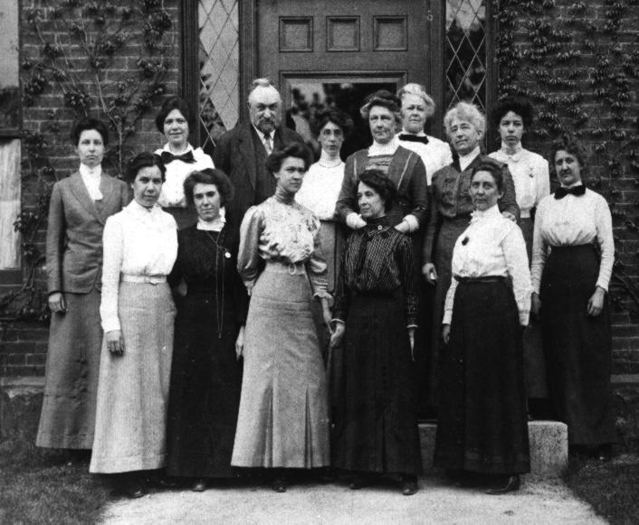

..  Copyright (C)  Mark Guzdial, Barbara Ericson, Briana Morrison
    Permission is granted to copy, distribute and/or modify this document
    under the terms of the GNU Free Documentation License, Version 1.3 or
    any later version published by the Free Software Foundation; with
    Invariant Sections being Forward, Prefaces, and Contributor List,
    no Front-Cover Texts, and no Back-Cover Texts.  A copy of the license
    is included in the section entitled "GNU Free Documentation License".

..  shortname:: Chapter2: What can Computers Do?
..  description:: Describes what a computer can do.

.. setup for automatic question numbering.

.. 	qnum::
	:start: 1
	:prefix: csp-2-1-

Bilgisayar Nedir ? 
==================================

*Öğrenme Hedefleri:*

- Bilgisayarların veri işlediğini anlamak,
- Bir programın bilgisayar için bir dizi talimat olduğunu anlamak,
- Turing Makinesi'nin ne olduğunu ve bilgisayarlar ile ne hesaplayıp ne hesaplayamacağımızı görebilmek için nasıl kullanıldığını anlamak,
- Bilgisayarların tüm problemleri çözemeyeceğini anlamak, 
- Programlama dilinin ne olduğunu anlamak

.. *Learning Objectives:*

.. - Understand that computers process data.
.. - Understand that a program is a sequence of instructions for a computer.
.. - Understand what a Turing machine is and how it is used in determining what we can and can not compute.
.. - Understand that computers can't solve all problems.
.. - Understand what a programming language is.

..	index::
	single: computer
	
..	index::
	single: program

**Bilgisayar (computer)**  girdilerle ,veri girişleriyle, *(input, data)* eylemler gerçekleştirebilen bir cihazdır. Eylemler, talimatlar dizisinden oluşan bir program tarafından belirtilir. Ancak, computer terimi gerçekte sadece elektronik bir cihazı karşılamıyor. Bir zamanlar computer teriminin doktor ya da garson gibi bir iş unvanı olduğunu ve kadın computerlar olduğunu biliyor muydunuz? Harward computerları astronomik hesaplamalar yapmak için işe alınmıştı. 

	

..	index::
	single: Harvard computers
	

    
    Figure 1: The Harvard Computers of 1913

Günümüz computerları elektroniktir, ancak ışık, DNA ve hatta `TinkerToys <http://www.retrothing.com/2006/12/the_tinkertoy_c.html>`_ ile bir bilgisayar oluşturmak mümkündür. Tüm bilgisayarlar talimatlara göre verileri manipüle ederler. 

.. Computers today are electronic, but it's possible to build a computer with light, or DNA, or even `TinkerToys <http://www.retrothing.com/2006/12/the_tinkertoy_c.html>`_.  All computers manipulate data based on instructions.

