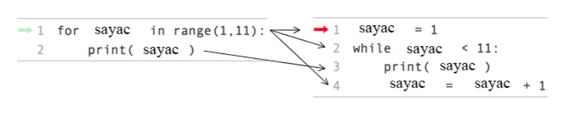

..  Copyright (C)  Mark Guzdial, Barbara Ericson, Briana Morrison
    Permission is granted to copy, distribute and/or modify this document
    under the terms of the GNU Free Documentation License, Version 1.3 or
    any later version published by the Free Software Foundation; with
    Invariant Sections being Forward, Prefaces, and Contributor List,
    no Front-Cover Texts, and no Back-Cover Texts.  A copy of the license
    is included in the section entitled "GNU Free Documentation License".

.. 	qnum::
	:start: 1
	:prefix: csp-8-3-
	
.. highlight:: java
   :linenothreshold: 4

while Döngüsü ile Sayma
===========================

Bilgisayarın belirli sayıdaki bir komutu tekrarlamasını sağlamak kolaydır. Bunu bir ``for`` döngüsüyle ve aşağıda gösterildiği gibi ``range`` fonksiyonuyla oluşturulan bir sayı listesiyle yapalım.  

.. codelens:: for_counter

	for sayac in range(1,11):
	    print(sayac)

Hadi bunu bir de ``while`` döngüsü ile yapalım.  

Örneğin, bilgisayarımıza 1’den 10’a kadar saymasını söyleyebiliriz. Döngünün içinde değerini arttıracağımız  bir ``sayac`` değişkeni kullanacağız. Arttırmaktan kasıt, döngünün her adımında sayac değişkenin değerine 1 ilave edeceğiz. Bir değişkenin değerine 1 ekleme işlemine **arttırma (increment)** , değerinden 1 çıkarma işlemine **azaltma (decrement)** denir. 
Sayacın, *istenen son değer artı bir* değerinden daha az olduğu sürece döngüye devam edeceğimizi unutmayın.

.. For example, we could have a computer count up from 1 to 10.  We will use a ``counter`` variable that we will **increment** inside the loop.  **Increment** means increase the value by one.  Note that we continue the loop as long as the ``counter`` is less than the desired last value plus one.  

.. codelens:: while_count

   sayac = 1
   while sayac < 11:
       print(sayac)
       sayac = sayac + 1
       
.. mchoice:: 8_3_1_While_Count_Q1
   :answer_a: 1
   :answer_b: 10
   :answer_c: 11
   :correct: c
   :feedback_a: Yanlış. sayac değişkeninin değeri döngünün her adımında 1  artacak şekildedir.
   :feedback_b: Yanlış. Son değer ekrana 10 olarak yazılır fakat print() fonksiyonu ile değer ekrana yazıldıktan sonra sayac değişken degerine +1 işlemi yapılmaktadır.
   :feedback_c: sayac değişkeninin değeri print() fonksiyonundan sonra 1 arttırılarak 11 olarak atanmıştır. while döngüsü sayac değişkeninin değerinin 11'den küçük olmadığından döngüden çıkılır. Program çalışmaya döngü gövdesinden sonra (eğer varsa) devam eder.  

   Döngümüz sona erdiğinde sayac değişkenimizin değeri kaç olacaktır?
 

.. 8_3_1_While_Count_Q1
..   :answer_a: 1
..   :answer_b: 10
..   :answer_c: 11
..   :correct: c
..   :feedback_a: Counter is incremented each time the loop executes.
..   :feedback_b: The last value to be printed is 10.  But, the counter is incremented after the current value is printed.
..   :feedback_c: Counter gets incremented to 11 after printing, and then the while loop tests counter, finds counter is not less than 11 and then continues after the body of the loop.

..   What is the value of counter after the loop finishes executing?

.. mchoice:: 8_3_2_NegativeCounter
   :answer_a: 5 4 3 2 1
   :answer_b: -5 -4 -3 -2 -1
   :answer_c: -4 -3 -2 -1 0
   :correct: c
   :feedback_a: Yanlış. x -5 değeri ile başlıyorsa ekrana çıkan ilk değer nasıl 5 olabilir?
   :feedback_b: Yanlış. Eğer yaptığımız ilk işlem x değişkeninin değerine +1 eklemek olmasaydı doğru olabilirdi.
   :feedback_c: Doğru. Ekrana yazdıracağımız değerleri atadığımız cikti değişkenine atama yapmadan önce x=x+1 işlemi ile x değişken değerini +1 arttırıyoruz, bu yüzden ekran çıktımız x in ilk aldığı değer olan (-5 + 1 = -4) den başlıyor.  

   Aşağıdaki kodun ekran çıktısı ne olacaktır?
   
   :: 
      
      cikti = ""
      x = -5
      while x < 0:
          x = x + 1
          cikti = cikti + str(x) + " "
      print(cikti)

..  8_3_2_NegativeCounter
..   :answer_a: 5 4 3 2 1
..   :answer_b: -5 -4 -3 -2 -1
..   :answer_c: -4 -3 -2 -1 0
..   :correct: c
..   :feedback_a: If x starts at -5 how can the first value printed be 5?
..   :feedback_b: This would be true if the print statement was before we incremented x.
..   :feedback_c: The value of x is incremented before it is printed so the first value printed is -4.  

..   What does the following code print?
   

      
..      output = ""
..      x = -5
..      while x < 0:
..          x = x + 1
..          output = output + str(x) + " "
..      print(output)
       
for ve while Döngülerinin Karşılaştırılması
-------------------------------------------------------
       
``for``  ve ``while`` döngülerini yanyana koyup aralarındaki farklara bakalım. 
``for``  döngüsündeki ilk satır, değişken ``sayacı`` ve 1 ile 10 arasındaki değerler listesini oluşturur. Daha sonra ``sayacı``  1'e eşit olarak ayarlar ve döngünün gövdesini yürütür. Döngünün gövdesinde, ``sayacın``  geçerli değerini yazdırır ve sonra listedeki bir sonraki değere geçer.

.. Let's look at these loops side by side.  The first line in the ``for`` loop creates the variable ``counter`` and the list of values from 1 to 10.  It then sets ``counter`` equal to 1 and executes the body of the loop.  In the body of the loop it prints the current value of ``counter`` and then changes ``counter`` to the next value in the list.  

``while`` döngüsünün ilk satırı değişken ``sayacı`` oluşturur ve değerini 1 olarak ayarlar. İkinci satır, ``sayacın`` değerinin 11'den düşük olup olmadığını test eder ve eğer varsa, döngü gövdesini çalıştırır. Döngünün gövdesi sayacın geçerli değerini yazdırır ve daha sonra ``sayacın`` değerini artırır. Sayaç 11'e eşit olduğunda döngü tekrarlamayı durdurur.

.. The first line of the ``while`` loop creates the variable ``counter`` and sets its value to 1.  The second line tests if the value of ``counter`` is less than 11 and if so it executes the body of the loop.  The body of the loop prints the current value of ``counter`` and then increments the value of ``counter``.  The loop will stop repeating when ``counter`` is equal to 11.  
       

    Figure 1: A for loop and the equivalent while loop
       
Bir döngüyü bilinen bir sayıda yürütmek istediğinizde kullanmak için **en iyi** döngü hangisidir? Hangi yol daha az kod kullanır veya daha az hataya yatkın görünür? Belirli bir kez kod tekrarlamak için bir süre döngü kullanarak sorunu, döngü vücudunda test ettiğiniz değeri değiştirmek için unutmak olabilir ve bu durumda sonsuz bir döngü olacaktır.

.. Which is the **best** loop to use when you want to execute a loop a known number of times?  Which way uses less code or seems less error prone?  The problem with using a ``while`` loop to repeat code a specific number of times is that you may forget to change the value that you are testing inside the body of the loop and in that case you will have an infinite loop.  

Aşağıdaki kod, değerleri 1'den 10'a basmanın başka bir yolunu gösterme çabasıdır. **Ancak, şu anda bir hata vardır ve sonsuz bir döngüdür.** Aşağıdaki kodu, sonsuz bir döngü olmaması için düzeltin.

.. The following code is an attempt to show another way to print the values from 1 to 10.  **However, it currently has an error and is an infinite loop**.  Fix the code below so that it isn't an infinite loop.

.. activecode:: while_counter_infinite

   sayac = 1
   while sayac <= 10:
       print(sayac)
   sayac = sayac + 1

.. The following is the correct code for printing a countdown from 10 to 0, but it is mixed up. Drag the blocks from the left and put them in the correct order on the right.  Don't forget to indent blocks in the body of the loop.  Just drag the block to the further right to indent.  Click the <i>Check Me</i> button to check your solution.

   	
.. parsonsprob:: 8_3_3_While_Countdown

   Aşağıdaki, 10'dan 0'a geri sayım için doğru koddur, ancak karışık durumdadır. Blokları sola doğru sürükleyin ve sağdaki sıraya yerleştirin. Döngünün gövdesindeki blokları girmeyi unutmayın. Girintiyi kaldırmak için bloğu sağa sürükleyin. Çözümünüzü kontrol etmek için <i>Check Me</i> düğmesini tıklayın.
   -----
   sayac = 10
   while sayac >= 0:
       print(sayac)
       sayac = sayac - 1 

.. index::
	pair: statements; for
	single: definite loop

.. Çift sayıları 0'dan 10'a kadar ekrana yazdırmak için gerekli kod aşağıdadır, ancak ihtiyacınız olmayan bazı ekstra kodları da içerir. Gerekli blokları soldan sürükleyin ve sağdaki sıraya yerleştirin. Döngünün gövdesindeki blokları girmeyi unutmayın. Girintiyi kaldırmak için bloğu sağa sürükleyin. Çözümünüzü kontrol etmek için Beni Kontrol Et düğmesini tıklayın.

	
.. parsonsprob:: 8_2_4_While_Count_Even

   Çift sayıları 0'dan 10'a kadar ekrana yazdırmak için gerekli kod aşağıdadır, ancak ihtiyacınız olmayan bazı ekstra kodları da içerir. Gerekli blokları soldan sürükleyin ve sağdaki sıraya yerleştirin. Döngünün gövdesindeki blokları girmeyi unutmayın. Girintiyi kaldırmak için bloğu sağa sürükleyin. Çözümünüzü kontrol etmek için <i>Check Me</i> düğmesini tıklayın.

   -----
   sayac = 0
   =====
   while sayac <= 10:
   =====
       print(sayac)
   =====
       sayac = sayac + 2
   =====
       sayac = sayac + 1 #distractor

.. tabbed:: 8_3_5_WSt

        .. tab:: Soru

           5 ile 9 arasında sayıları saymak için bir süre döngü kullanın. Döngündeki her bir interaksiyonda sayaçtaki mevcut değeri yazdırın. 
           
           .. activecode::  8_3_5_WSq
                :nocodelens:

        .. tab:: Cevap
            
          .. activecode::  8_3_5_WSa
              :nocodelens:
              
              # Sayaç değişkenini tanımla. 
              sayac = 5  
              # Döngü kontrolünü belirle
              while sayac < 10 :
                # sayaç değişkeninin değerini yazdır
                print(sayac)
                sayac = sayac + 1
                

    

