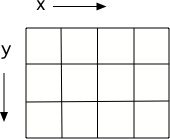

..  Copyright (C)  Mark Guzdial, Barbara Ericson, Briana Morrison
    Permission is granted to copy, distribute and/or modify this document
    under the terms of the GNU Free Documentation License, Version 1.3 or
    any later version published by the Free Software Foundation; with
    Invariant Sections being Forward, Prefaces, and Contributor List,
    no Front-Cover Texts, and no Back-Cover Texts.  A copy of the license
    is included in the section entitled "GNU Free Documentation License".

..  shortname:: Chapter: What You Can Do with a Computer
..  description:: Some tidbits of what you can do with a computer

.. setup for automatic question numbering.

.. 	qnum::
	:start: 1
	:prefix: csp-1-6-

.. |runbutton| image:: Figures/run-button.png
    :height: 20px
    :align: top
    :alt: run button

.. |audiobutton| image:: Figures/start-audio-tour.png
    :height: 20px
    :align: top
    :alt: audio tour button
  

Görüntülerle Hesapla
====================

..	index::
	single: images
	
..	index::
	single: pictures
	
..	index::
	single: pixels

Bir bilgisayarda resimler, **resim (piksel - pixels)** öğeleri (els) için piksel adı verilen küçük bitlere ayrılır. Bunlar bir ızgara üzerinde, soldan sağa (yatay veya x ekseni) ve yukarıdan aşağıya (dikey veya y ekseni) yerleştirilir.
	
.. Pictures on a computer are broken up into little bits called **pixels**, for *picture* (pix) *elements* (els).  These are laid out on a grid, from left to right (the horizontal or **x** dimension) and top to bottom (the vertical or **y** dimension).

    
    Figure 1: A grid with horizontal (x) and vertical (y) dimensions 

Pikseller oldukça küçüktür. Aşağıdaki bu küçük resim bile 180 sütun ve 240 satırlık piksel içeriyor:

 .. Pixels are quite small.  Even this small picture below has 180 columns and 240 rows of pixels:

.. figure:: Figures/arch.jpg
    :align: center
    :alt: picture of an arch from Oxford, England
    :figclass: align-center
    
    Figure 2: Picture of an arch from Oxford, England

.. mchoice:: 1_6_1_Image_Q1
   :answer_a: Soldan Sağa
   :answer_b: Sağdan Sola
   :answer_c: Yukardan Aşağıya
   :answer_d: Aşağıdan Yukarıya
   :correct: c
   :feedback_a: Yanlış. x değeri soldan sağa doğru artar. 
   :feedback_b: Yanlış. Yatay yön x yönüdür. 
   :feedback_c: Doğru. y değeri yukardan aşağıya doğru artar. 
   :feedback_d: Yanlış. Bu kartezyen koordinat sisteminde yaygın olmakla birlikte burada doğru değildir. 
   
   Hangi yoldan resim y-yönünde artar?

..   :answer_a: Soldan Sağa
..   :answer_b: Sağdan Sola
..   :answer_c: Yukardan Aşağıya
..   :answer_d: Aşağıdan Yukarıya
..   :correct: c
..   :feedback_a: The x value increases from left to right
..   :feedback_b: The horizontal direction is the x direction
..   :feedback_c: The y value increases from top to bottom
..   :feedback_d: This is common on a Cartesian coordinate system, but it is not true here
   
..   Which way does y increase on an image?

Her piksel kendiyle alakalı bir renge sahiptir: Belli bir miktar kırmızı, yeşil ve mavi. Bu miktar 0-255 arasında olabilir, 0 bu renklerden hiç biriyken 255 ise bu renklerden maksimum miktardır. Piksel ışık kullanılarak görüntülenir, boyamaz, bu yüzden boyayı karıştırmakla elde ettiğiniz deneyimden daha farklı bir şekilde çalışır. Örneğin, yeşil yapmak için mavi ve sarı boyayı karıştırırsınız, ancak sarı ışık yapmak için kırmızı ve yeşil ışığı karıştırırsınız. Kendiniz bu prosedürü denemek için şu adrese bakınız: http://www.webexhibits.org/causesofcolor/1BE.html 

.. Each pixel has a color associated with it: An amount of red, an amount of green, and an amount of blue.  The amount can be in the range of 0 to 255 where 0 is none of that color and 255 is the maximum amount of that color.  A pixel is displayed using light, not paint, so it may work a bit differently than you might expect if you only have experience making colors by mixing paint.  For example, you would mix blue and yellow paint to make green, but you mix red and green light to make yellow light.  See http://www.webexhibits.org/causesofcolor/1BE.html for a procedure to try this out for yourself.

.. figure:: http://www.d.umn.edu/~mharvey/colorwheel.jpg
    :width: 200px
    :align: center
    :alt: a color wheel for combining color lights
    :figclass: align-center
    
    Figure 3: How lights combine to make colors

Photoshop'taki tüm görüntü manipülasyonları ve Instagram veya Hipstamatic'teki tüm filtreler, her bir pikseldeki bu kırmızı, yeşil ve mavi renk bileşenlerini işleyerek oluşturulur.

.. All image manipulations in Photoshop and all filters in Instagram or Hipstamatic are created through manipulating those red, green, and blue color components in each pixel.

Bu resimdeki kırmızıyı kaldıralım. Aşağıdaki program bunu yapıyor.
.. Let's remove the red from this picture.  The program below does that.

..	index::
	single: comment
	pair: programming; comment
**Aşağıdaki programda çok fazla satır var. Şu anda sizin için hiçbir şey ifade etmiyorlarsa endişelenmeyin.**

 - Özellikle görüntüleri işlemek için programlar yazdığımızda, birçok satırı görmezden gelebilirsiniz. Bazıları görüntülerle çalışmamıza izin veren bir kütüphaneden alınmaktadır, ``from image import *``. gibi. Diğerleri gibi ``pencere = ImageWin(img.getWidth(),img.getHeight())`` ve ``img.draw(win)``   Sonucu görelim.
  - # sembolünden sonraki kelimler bilgisayar tarafından ihmal edilir. Bunlar insan okurlara programı anlamalarına yardım etmek için konulan **yorum (comment)**lardır.

..  - Especially when we write programs to manipulate images, you can ignore many of the lines.  Some read in a library to allow us to work with images, like ``from image import *``.  Others like ``win = ImageWin(img.getWidth(),img.getHeight())`` and ``img.draw(win)`` let us see the result.
..  - Words after the ``#`` are ignored by the computer.  They are **comments** to human readers to help them understand a program. 

Önemli olan satırlar yorumların altındadır (``#`` ile başlayan satırlar). Önemli satırların sesli açıklamasını dinlemek için |audiobutton| butonuna basın. |runbutton| butonuna basarak değişen resmi görünüz. Lütfen tüm bu piksellerin işlenmesinin birkaç dakika sürebileceğini unutmayın.
  
.. The lines that are important are under the comments (lines that start with a ``#``). Press the |audiobutton| button to hear an audio explanation of the important lines.  Press the |runbutton| button to run the program and show the changed image.  Please note that processing all those pixels can take a few minutes.  

.. raw:: html

    
    
.. activecode:: Images_1
    :tour_1: "Important Lines Tour"; 3,6,10,14: timg1-line361014; 4: timg1-line4; 7: timg1-line7; 8: timg1-line8; 11: timg1-line11; 12: timg1-line12; 15-16: timg1-line15-16;
    :nocodelens:

    from image import *
    
    # Dosyadan bir resim yaratın
    img = Image("arch.jpg")

    # Bütün pikseller üzerinden döngü yapın. 
    pixels = img.getPixels()
    for p in pixels:
    
        # Kırmızıyı temizle
        p.setRed(0)
        img.updatePixel(p)
           
    # Değişen resmi göster
    win = ImageWin(img.getWidth(),img.getHeight())
    img.draw(win)

    
.. mchoice:: 1_6_2_Image_Black
   :answer_a: Resmi hala görüyorsun, ama hepsi gri tonlarında.  
   :answer_b: Resim tamamen beyaz.
   :answer_c: Resim tamamen siyah.
   :correct: c
   :feedback_a: Yanlış. Tabi eğer tüm renk değerlerini 0 olarak ayarlamadıysan
   :feedback_b: Yanlış. Denedin mi ? Tüm değerleri 0 yerine 255 olarak ayarlasaydın bu doğru olurdu. 
   :feedback_c: Doğru. Siyah ışığın olmamasıdır. Bu yüzden tüm renkleri sıfıra ayarlamak, ışığın olmamasına sebep olacağından siyah elde etmemizi sağlar.
   
   Tüm renkleri 0'a ayarladığınızda ne olacağını düşünüyorsunuz? ``p.setBlue(0)`` ve ``p.setGreen(0)`` satırlarını ``p.setRed(0)`` satırının altına, yukardaki programa ekleyin ve kontrol için çalıştırın.

..   :answer_a: You still see the picture, but it is all in shades of gray.  
..   :answer_b: The picture is all white.
..   :answer_c: The picture is all black.
..   :correct: c
..   :feedback_a: Not if you set all the color values to 0.
..   :feedback_b: Did you try it?  This would be true if you set all the values to 255 instead of 0.
..   :feedback_c: Black is the absence of light so setting all colors to 0 results in an all black image since there is no light.
   
 ..  What do you think happens when you set all the colors to 0?  Try adding ``p.setBlue(0)`` and ``p.setGreen(0)`` to the program above after the ``p.setRed(0)`` and run it to check.
 

